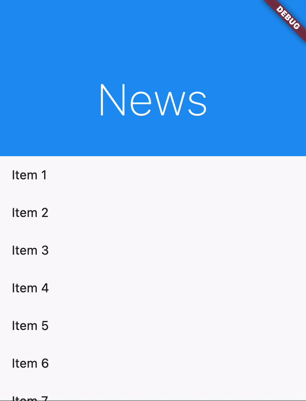

# ScrollBuilder

A very simple Flutter widget that makes it easier to implement effects based on a scroll offset. For example, widgets in a `SliverAppBar`.

## Example

```dart
SliverAppBar(
  collapsedHeight: collapsedHeight,
  expandedHeight: expandedHeight,
  titleSpacing: 0,
  pinned: true,
  flexibleSpace: FlexibleSpaceBar(
    expandedTitleScale: 1.0,
    title: ScrollBuilder(
      scrollController: controller,
      threshold: scrollAmountUntilCollapsed,
      builder: (context, fraction, child) {
        return Transform.translate(
          offset: Offset(
            0,
            -24 * Curves.easeOutCubic.transform(1 - fraction),
          ),
          child: Transform.rotate(
            angle: pi * 4 * Curves.easeInOut.transform(fraction),
            child: ImageFiltered(
              imageFilter: ImageFilter.blur(
                sigmaX: fraction != 0 && fraction != 1 ? 0.5 : 0,
                sigmaY: fraction != 0 && fraction != 1 ? 0.5 : 0,
              ),
              child: Text(
                'News',
                style: TextStyle(
                  fontSize: Tween<double>(
                    begin: 18,
                    end: 56,
                  ).transform(1 - fraction),
                  fontWeight: FontWeight.lerp(
                    FontWeight.w200,
                    FontWeight.w500,
                    fraction,
                  ),
                ),
              ),
            ),
          ),
        );
      },
    ),
  ),
),
```

## Result

